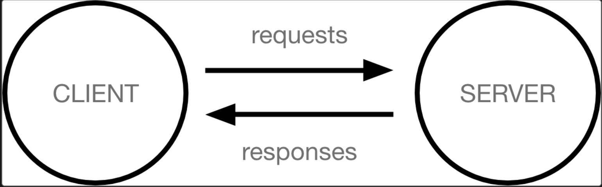
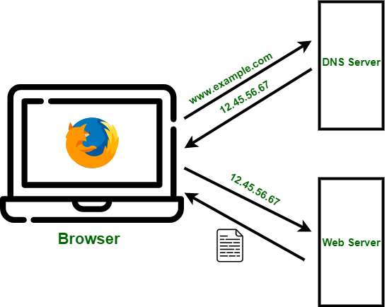
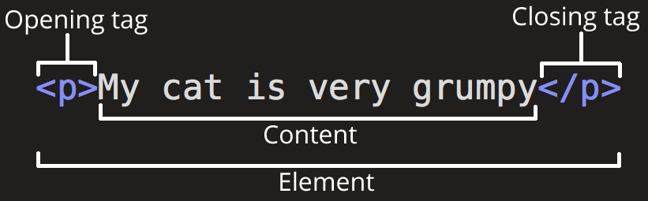

# 1. Pendahuluan

## Bagaimana Cara Kerja Website?

Komputer yang terhubung ke internet disebut sebagai **client** (klien) dan **server**. Diagram sederhana interaksi keduanya terlihat seperti ini:



- **Client**: Perangkat pengguna yang terhubung ke internet (seperti laptop atau ponsel) dan perangkat lunak pengakses web (seperti browser Chrome atau Firefox).
- **Server**: Komputer yang menyimpan halaman web, aplikasi, atau data. Ketika client meminta akses, server akan mengirimkan salinan data tersebut untuk ditampilkan di browser pengguna.



### Alur Singkat:

1. Setiap client dan server memiliki alamat unik di internet yang disebut **IP Address**.
2. Saat kamu mengunjungi `www.example.com`, browser akan melakukan pencarian ke **DNS** untuk mengetahui IP server tersebut.
3. Client mengirimkan **Request** (permintaan) ke server berdasarkan IP tersebut.
4. Server mengirimkan **Response** (jawaban) kembali ke client dalam bentuk file (HTML, CSS, JS) yang kemudian dirender oleh browser.

---

# 2. Tools Pengembangan Web

Untuk mulai membangun website, kita membutuhkan beberapa peralatan dasar:

- **Text Editors / IDE**: Tempat menulis kode. Pilihan populer: [Visual Studio Code](https://code.visualstudio.com/), [Cursor](https://www.cursor.com/), [WebStorm](https://www.jetbrains.com/webstorm/).
- **Browsers**: Untuk melihat hasil kode (Chrome, Firefox, Edge).
- **Version Control System**: [Git](https://git-scm.com/) untuk mengelola riwayat perubahan kode.
- **Hosting Providers**: Tempat meletakkan website agar bisa diakses orang lain (GitHub Pages, Netlify, Vercel, AWS, dll).

---

# 3. HTML (HyperText Markup Language)

## Apa itu HTML?

HTML adalah bahasa markup standar yang digunakan untuk menentukan struktur sebuah halaman web.

Bayangkan HTML sebagai **kerangka tulang** dari sebuah bangunan. HTML terdiri dari serangkaian **elemen** yang memberitahu browser bagaimana konten harus ditampilkan (misalnya: ini adalah judul, ini adalah paragraf, ini adalah link).

## Anatomi Elemen HTML



Contoh elemen HTML:

```html
<p>Hello, GDGoC ITS!</p>
```

Bagian-bagiannya:

1. **Opening Tag (Tag Pembuka)**  
   Nama elemen yang dibungkus kurung sudut, misalnya `<p>`. Ini menandakan awal elemen paragraf.

2. **Content (Konten)**  
   Teks atau elemen lain yang berada di dalam elemen, misalnya `Hello, GDGoC ITS!`.

3. **Closing Tag (Tag Penutup)**  
   Tag dengan tanda garis miring di depan nama elemen, misalnya `</p>`. Ini menandakan akhir elemen paragraf.

4. **Whole Element (Elemen Utuh)**  
   Gabungan opening tag, content, dan closing tag:

   ```html
   <p>Hello, GDGoC ITS!</p>
   ```

Beberapa elemen tidak memiliki closing tag, disebut **void elements**, misalnya:

```html

<br />
<hr />
```

---

# 4. Struktur Dasar Dokumen HTML

Setiap halaman HTML yang baik memiliki struktur dasar seperti ini:

```html
<!DOCTYPE html>
<html lang="id">
  <head>
    <meta charset="UTF-8" />
    <meta name="viewport" content="width=device-width, initial-scale=1.0" />
    <title>Halaman Pertamaku</title>
  </head>
  <body>
    <h1>Halo, GDGoC ITS!</h1>
    <p>Ini adalah halaman HTML pertamaku.</p>
  </body>
</html>
```

Penjelasan:

- `<!DOCTYPE html>`  
  Memberitahu browser bahwa dokumen ini menggunakan HTML5.

- `<html lang="id"> ... </html>`  
  Elemen root dari dokumen HTML.  
  Atribut `lang="id"` memberi tahu bahwa bahasa utama halaman adalah Bahasa Indonesia.

- `<head> ... </head>`  
  Berisi informasi tentang halaman (bukan konten utama yang terlihat user), seperti:
  - `<meta charset="UTF-8">` → mendefinisikan encoding karakter.
  - `<meta name="viewport" ...>` → membuat tampilan responsif di perangkat mobile.
  - `<title>...</title>` → teks yang muncul di tab browser.

- `<body> ... </body>`  
  Berisi konten utama yang akan ditampilkan di browser: teks, gambar, link, form, dll.

---

# 5. Elemen Teks Dasar

## 5.1 Heading (Judul)

HTML menyediakan 6 tingkat heading:

```html
<h1>Judul Utama Halaman</h1>
<h2>Subjudul</h2>
<h3>Sub-subjudul</h3>
<h4>Heading level 4</h4>
<h5>Heading level 5</h5>
<h6>Heading level 6</h6>
```

- `<h1>` biasanya dipakai untuk judul utama halaman, digunakan sekali per halaman.
- `<h2>`–`<h6>` untuk sub-bagian.

## 5.2 Paragraf

```html
<p>Ini adalah sebuah paragraf yang menjelaskan sesuatu.</p>
<p>Ini paragraf lain.</p>
```

Paragraf digunakan untuk teks biasa yang agak panjang.

## 5.3 Teks Tebal dan Miring

```html
<p><strong>Penting:</strong> Jangan lupa daftar event sebelum kuota habis.</p>
<p>Belajar <em>secara konsisten</em> akan membantumu memahami konsep lebih dalam.</p>
```

- `<strong>` → teks penting (biasanya tampil tebal/bold).
- `<em>` → teks yang diberi penekanan (biasanya miring/italic).

---

# 6. Link dan Gambar

## 6.1 Link (Anchor)

```html
<a href="https://www.acaryawibawantra.xyz/gdgoc" target="_blank">
  Kunjungi Modul Web Development GDGoC ITS
</a>
```

Atribut penting:

- `href` → alamat tujuan link.
- `target="_blank"` → membuka di tab baru (opsional).

## 6.2 Gambar

```html

```

Atribut penting:

- `src` → path atau URL gambar.
- `alt` → teks alternatif jika gambar gagal dimuat, juga penting untuk aksesibilitas.

---

# 7. List (Daftar)

## 7.1 Unordered List (Bullet)

```html
<ul>
  <li>HTML</li>
  <li>CSS</li>
  <li>JavaScript</li>
</ul>
```

## 7.2 Ordered List (Nomor)

```html
<ol>
  <li>Buka browser</li>
  <li>Buka file index.html</li>
  <li>Lihat hasilnya</li>
</ol>
```

---

# 8. Struktur Semantik Sederhana Halaman

Agar halaman mudah dibaca manusia dan mesin (search engine, screen reader), gunakan elemen semantik:

```html
<body>
  <header>
    <h1>GDGoC ITS – Web Foundations</h1>
    <p>Belajar HTML, CSS, dan JavaScript dari dasar.</p>
  </header>

  <main>
    <section>
      <h2>Tentang Workshop</h2>
      <p>
        Di workshop ini kita akan membangun sebuah halaman Event Registration sederhana.
      </p>
    </section>

    <section>
      <h2>Topik yang Dipelajari</h2>
      <ul>
        <li>HTML: struktur dan elemen semantik</li>
        <li>CSS: styling dasar</li>
        <li>JavaScript: interaktivitas dan DOM</li>
      </ul>
    </section>
  </main>

  <footer>
    <p>Built for GDGoC ITS Web Foundations.</p>
  </footer>
</body>
```

Elemen yang digunakan:

- `<header>` → bagian kepala halaman (judul, navigasi).
- `<main>` → konten utama.
- `<section>` → bagian/section isi yang punya topik tertentu.
- `<footer>` → bagian kaki halaman (informasi penutup, copyright, dll).

---

# 9. Latihan Singkat

Cobalah buat file `index.html` sederhana dengan spesifikasi:

1. Menggunakan struktur dasar HTML5 lengkap (`<!DOCTYPE html>`, `<html>`, `<head>`, `<body>`).
2. Di dalam `<body>`:
   - Judul halaman dengan `<h1>`: "Halo, Web Development!"
   - Paragraf yang menjelaskan tujuanmu belajar web.
   - List (ordered atau unordered) yang berisi 3 hal yang ingin kamu pelajari (misal: HTML, CSS, JS).
   - Sebuah link ke halaman modul Web Foundations.
3. Simpan sebagai `index.html`, lalu buka di browser.

Contoh struktur minimal (silakan modifikasi sendiri):

```html
<!DOCTYPE html>
<html lang="id">
  <head>
    <meta charset="UTF-8" />
    <meta name="viewport" content="width=device-width, initial-scale=1.0" />
    <title>Halo, Web Development!</title>
  </head>
  <body>
    <h1>Halo, Web Development!</h1>
    <p>
      Saya belajar web development supaya bisa membuat website untuk komunitas
      GDGoC ITS.
    </p>

    <h2>Yang ingin saya pelajari:</h2>
    <ul>
      <li>HTML dasar</li>
      <li>CSS untuk styling</li>
      <li>JavaScript untuk interaktivitas</li>
    </ul>

    <p>
      Lihat modul lengkap di
      <a href="https://www.acaryawibawantra.xyz/gdgoc" target="_blank">
        Modul Web Development GDGoC ITS
      </a>.
    </p>
  </body>
</html>
```

---

# 10. Ringkasan Modul

Di Modul 1.1 ini kamu sudah belajar:

- Gambaran cara kerja website (client, server, request, response).
- Tools dasar untuk pengembangan web.
- Konsep HTML sebagai kerangka halaman web.
- Anatomi elemen HTML (tag pembuka, konten, tag penutup).
- Struktur dasar dokumen HTML5.
- Elemen-elemen dasar: heading, paragraf, teks tebal/miring.
- Link, gambar, dan list.
- Struktur semantik sederhana dengan `<header>`, `<main>`, `<section>`, dan `<footer>`.

Modul berikutnya (1.2) akan fokus pada **CSS**, yaitu bagaimana membuat tampilan halaman yang lebih menarik dan terstruktur rapi.
